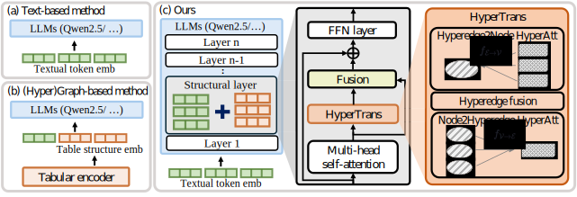

# HInT: Hypergraph Infusion at the Structural Layers Improves Table Understanding<br>[ICML 2026]

[Project Page](https://mlv-group.github.io/HInT/) | [Paper](#) | [Citation](#citation)

> Official repository for **"HInT: Hypergraph Infusion at the Structural Layers Improves Table Understanding"**.

## Overview

Overview of the proposed *HInT* (*Hypergraph Infusion for Table reasoning*) framework. We probe a decoder-only LLM to identify the small subset of layers and attention heads that encode row- and column-level table structure. At each of these *structural layers*, *HInT* constructs a table hypergraph over cells and headers, applies lightweight HyperTrans message passing, and fuses the resulting structural features back into the token hidden states through a gated fusion &mdash; all while leaving the standard autoregressive computation untouched.

<p align="center">
  
</p>

## Abstract

Decoder-only large language models (LLMs) struggle with table reasoning because tables must be serialized, which can obscure row- and column-level structure. Prior graph and hypergraph approaches encode structure with an external encoder, but their gains are often inconsistent under autoregressive decoding. We analyze how tabular structure is represented inside decoder-only LLMs and find that row and column relations are concentrated in a small subset of layers and attention heads. Based on this observation, we propose *HInT* (*Hypergraph Infusion for Table reasoning*), which injects hypergraph-derived structural features directly into the layers where these relations are concentrated. *HInT* constructs a table hypergraph over cells and headers, applies lightweight message passing, and fuses the resulting structural features with token hidden states through gated fusion. Experiments across diverse table reasoning tasks show consistent improvements over text-only baselines and prior (hyper)graph-based methods.

## Code

Code coming soon.

## Citation

If you find this work useful, please consider citing:

```bibtex
@inproceedings{lee2026hint,
  title     = {HInT: Hypergraph Infusion at the Structural Layers Improves Table Understanding},
  author    = {Lee, Wonjin and Jeong, Soomi and Kim, Kwang In},
  booktitle = {ICML},
  year      = {2026}
}
```
